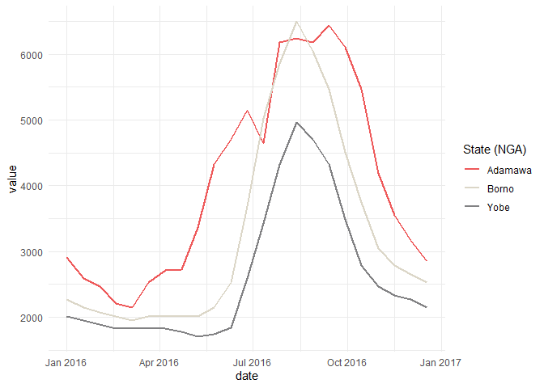
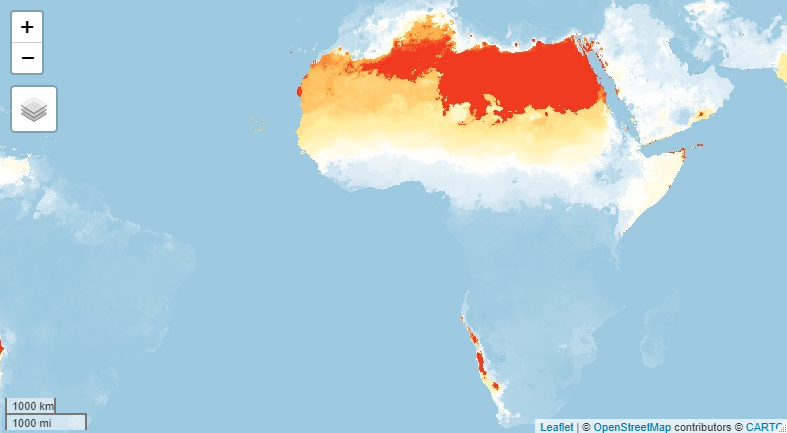
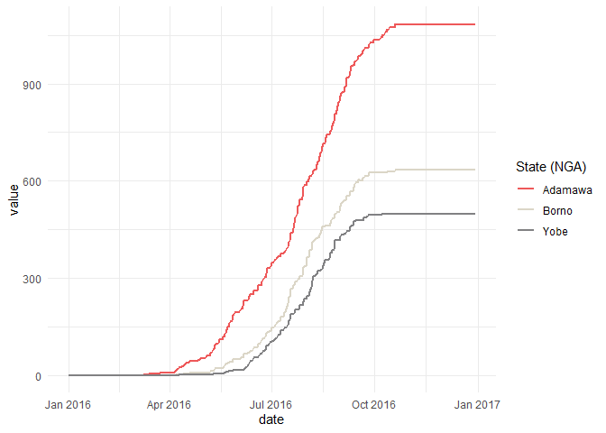

<!-- README.md is generated from README.Rmd. Please edit that file -->

# easyrgee

<!-- badges: start -->

[](https://github.com/impact-initiatives-geospatial/easyrgee/actions)
[](https://lifecycle.r-lib.org/articles/stages.html#experimental)
<!-- badges: end -->

The goal of easyrgee is to …

## Installation

You can install the development version of easyrgee from
[GitHub](https://github.com/) with:

``` r
# install.packages("devtools")
devtools::install_github("impact-initiatives-geospatial/easyrgee")
remotes::install_github("impact-initiatives-geospatial/easyrgee"")
```

## Note

The package contains mainly convenience wrappers for the
[rgee](https://github.com/r-spatial/rgee) package. The
[rgee](https://github.com/r-spatial/rgee) package requires a GEE
account.

Much of the functionality of this package is slowly being integrated
into the [exploreRGEE](https://github.com/joshualerickson/exploreRGEE)
package.

## Examples

### Zonal stats

This is a basic example which shows you how to solve a common problem:
extracting zonal statistics of an `ee$ImageCollection` and plotting

First we load a few packages, initialize earth engine, and load in an
internal data set which contains 3 admin polygons in NE Nigeria.

``` r
library(easyrgee)
library(rgee)
library(ggplot2)

ee_Initialize(quiet=T)

# 3 admin boundaries in NE NGA
dat<- easyrgee::adm1_ne_nga
```

Next we load in a MODIS NDVI `ee$ImageCollection` for 2016

``` r
modis_ndvi <- ee$ImageCollection("MODIS/006/MOD13Q1")$select("NDVI" )$filterDate("2016-01-01","2016-12-31")
```

Finally we perform the aggregation/reduction with `ee_extract_long`.

`ee_extract_long` is a tool that can be used to extract values or zonal
statistics over both Images and Image collections. It is a wrapper
around `rgee::ee_extract`. `ee_extract_long` uses a couple of
server-side processes and client-side regex manipulations to help
standardize the output while pivoting `rgee::ee_extract` output from
wide to long format. The result is a data.frame ready for
processing/plotting.

``` r
median_ndvi<- easyrgee::ee_extract_long(ic = modis_ndvi,
                              sf = dat,
                              sf_col = "ADM1_EN",
                              scale = 250,
                              reducer = "median")
```

Now we can easily use `ggplot` to visualize the results

``` r
median_ndvi |> 
  ggplot(aes(x=date, y= value, color=ADM1_EN))+
  geom_line(lwd=1)+
  scale_color_manual(name="State (NGA)" ,values =c("#ee5859","#DBD6C7", "#818183") )+
  theme_minimal()
```



### Identify Start of Rainy Season

Start time of rainy season can have implications on crop harvest which
can then impact well-being/livelihoods. Therefore, we have made a
function to help identify a date which can be considered start of rainy
season. The function works by

1.  Creating a cumulative precipitation `ee$ImageCollection` with each
    all pixels in each consecutive image containing the sum of all
    previous values
2.  It then finds the first day the user-defined threshold was met for
    each pixel. The result is a raster ranging from 0-365 (days of year)

``` r
chirps <-  ee$ImageCollection("UCSB-CHG/CHIRPS/DAILY")$
  filterDate("2016-01-01","2016-12-31")
precip_threshold_doy<- ee_accum_reduce_to_doy(ic = chirps,thresh = 20,band = "precipitation")


#visualize
Map$setCenter(zoom = 3)
Map$addLayer(precip_threshold_doy,
             visParams = list(min=0, max=365, palette='#9ecae1,#ffffff,#ffeda0,#feb24c,#f03b20'))
```



The function also relies on the internal function:
`ee_accumulate_band_ic` which is handy on it’s own. Using this function
is handy to explore the data and set a reasonable threshold for your
context. Here we create an `imageCollection` of cumulative precipitation
values.

``` r
precip_cumulative<- easyrgee::ee_accumulate_band_ic(ic = chirps, band = "precipitation")
```

Next we again use `ee_extract_long` to extract the daily median values
of 3 different geographic zones

``` r
median_cumulative_rainfall<- easyrgee::ee_extract_long(ic = precip_cumulative,sf = dat,sf_col = "ADM1_EN",scale = 5000,reducer = "median")
```

use `ggplot` to visualize rainfall accumulation curves by region

``` r
median_cumulative_rainfall |> 
  ggplot(aes(x=date, y= value, color=ADM1_EN))+
  geom_line(lwd=1)+
  scale_color_manual(name="State (NGA)" ,values =c("#ee5859","#DBD6C7", "#818183") )+
  theme_minimal()
```


