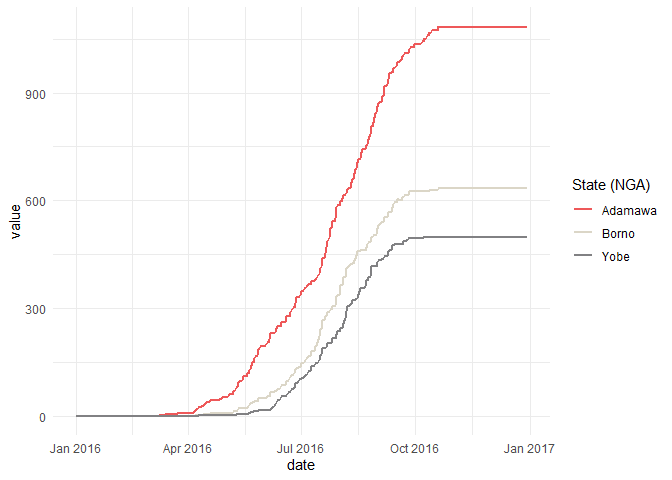

```{r, include = FALSE}
knitr::opts_chunk$set(
  collapse = TRUE,
  comment = "#>"
)

```

```{r warning=FALSE, message=FALSE, eval=F}

library(easyrgee)
library(rgee)
library(ggplot2)

ee_Initialize()

dat<- easyrgee::adm1_ne_nga


chirps <-  ee$ImageCollection("UCSB-CHG/CHIRPS/DAILY")$
  filterDate("2016-01-01","2016-12-31")

```

```{r, echo=F, eval=F}

dat_internal <-  readRDS("dat_internal.rds")
median_ndvi <- dat_internal$median_ndvi
median_cumulative_rainfall <-  dat_internal$median_cumulative_rainfall
```
# Zonal Stats

`ee_extract_long` is a tool that can be used to extract values or zonal statistics over both Images and Image collections. It is a wrapper around `rgee::ee_extract` which does the same, but returns the output in wide format. `ee_extract_long` also contains a several server-side processes and client-side regex manipulations to help standardize the output. The result is a data.frame ready for processing/plotting.

Here is a short example

```{r, eval=F}

 
modis_ndvi <- ee$ImageCollection("MODIS/006/MOD13Q1")$select("NDVI" )$filterDate("2016-01-01","2016-12-31")


median_ndvi<- ee_extract_long(ic = modis_ndvi,
                              sf = dat,
                              sf_col = "ADM1_EN",
                              scale = 250,
                              reducer = "median")
```


### Visualize NDVI

```{r,eval=F, fig.width=7}
median_ndvi |> 
  ggplot(aes(x=date, y= value, color=ADM1_EN))+
  geom_line(lwd=1)+
  scale_color_manual(name="State (NGA)" ,values =c("#ee5859","#DBD6C7", "#818183") )+
  theme_minimal()

```


# Identify Start of Rainy Season

Start time of rainy season can have implications on crop harvest which can then impact well-being/livelihoods. Therefore, we have made a function to help identify a date which can be considered start of rainy season. The function works by

1. Creating a cumulative precipitation `ee$ImageCollection` with each all pixels in each consecutive image containing the sum of all previous values
2. It then finds the first day the user-defined threshold was met for each pixel. The result is a raster ranging from 0-365 (days of year)


```{r, eval=F,fig.width=7}
precip_threshold_doy<- ee_accum_reduce_to_doy(ic = chirps,thresh = 20,band = "precipitation")


#visualize
Map$setCenter(zoom = 3)
Map$addLayer(precip_threshold_doy,
             visParams = list(min=0, max=365, palette='#9ecae1,#ffffff,#ffeda0,#feb24c,#f03b20'))

```


The function also relies on the internal function: `ee_accumulate_band_ic` which is handy on it's own. Using this function is handy to explore the data and set a reasonable threshold for your context. Here we create an `imageCollection` of cumulative precipitation values. 

```{r, echo=T, eval=F}
precip_cumulative<- ee_accumulate_band_ic(ic = chirps, band = "precipitation")
```

Next we again use `ee_extract_long` to extract the daily median values of 3 different geographic zones 

```{r,eval= F}
median_cumulative_rainfall<- ee_extract_long(ic = precip_cumulative,sf = dat,sf_col = "ADM1_EN",scale = 5000,reducer = "median")
```


# Plot Rainfall Accumulation
```{r,eval=F, fig.width=7}
median_cumulative_rainfall |> 
  ggplot(aes(x=date, y= value, color=ADM1_EN))+
  geom_line(lwd=1)+
  scale_color_manual(name="State (NGA)" ,values =c("#ee5859","#DBD6C7", "#818183") )+
  theme_minimal()


  
```


```{r,eval=F,echo=F}
# the code that got me there
#####################3
tst_ic <- chirps_one_yr$select("precipitation")
tst_img <-  tst_ic$first()
first2 <- ee$List(list(ee$Image(tst_ic$first())))
previous <- ee$Image(ee$List(first2)$get(-1))

added <- tst_img$add(previous)$
  set('system:time_start', tst_img$get('system:time_start'))


ret_list <- ee$List(list(first2))$add(added)
ret_list$getInfo()
# ret_list_list <- ret_list$toList(ret_list$size())

ret_list |> ee_print()

ee$ImageCollection$fromImages(ret_list$flatten()) |> ee_print()
```


```{r, echo=F,eval=F}


 chirps = ee$ImageCollection("UCSB-CHG/CHIRPS/DAILY")
 chirps_one_yr = chirps$filterDate("2016-01-01","2016-12-31")


 time0 = chirps_one_yr$first()$get('system:time_start')

#  ee$Image(0)$set('system:time_start', time0) |> ee_print()
#  first = ee$List([
#  
#   ee$Image(0)$set('system:time_start', time0)$select([0], ['precipitation'])
#   ee$Image(0)$set('system:time_start', time0)$select(0)$rename('precipitation') |> ee_print()
# ])
#   ee$Image(0)$set('system:time_start', time0)$select(0) |> ee_print()
#  
  
first = ee$List(
 
  ee$Image(0)$set('system:time_start', time0)$select(0)$rename("precipitation")
)

# first$add(chirps$first())

first_img_test <-  ee$Image(0)$set('system:time_start', time0)$select(0)$rename("precipitation")
# ee$List(list(first_img_test))$getInfo() |> ee_print()
system:time_start
ee$Image(0)$set('system:time_start', time0) |> ee_print()

first2 <- ee$List(
 
  list(ee$Image(0)$set('system:time_start', time0)$select(0)$rename("precipitation"))
)


prev <- ee$Image(ee$List(list(first))$get(-1)) 
prev2<- ee$Image(ee$List(list(first2))$get(-1)) 

prev |> ee_print()
prev2 |> ee_print()

added_ck <- ee$Image(chirps_one_yr$first())$
  add(prev)
added_ck |> ee_print()
 
accum_output_raw<- ee$List(list(first))$add(ee$Image(added_ck))
accum_output_raw<- ee$List(list(first))$add(added_ck)
# accum_output_raw<- ee$List(list(first))$add(added_ck)

ee$ImageCollection(ee$List(accum_output_raw)) |> ee_print()


ilist_ck$add(added_ck) |> ee_print()

ee$List(list(first))$add(added_ck) |> ee_print()


ee$List(list(ilist_ck))$add(added_ck) |> ee_print()

ee$Image(ee$List(list)$get(-1))
debugonce(ee$List$get)
ee$Image(ee$List(first)$get(-1)) |> ee_print()

first$getInfo()
first$getInfo()

chirps_one_yr$first() |> ee_print()

# This is a function to pass to Iterate().

bs = chirps_one_yr$iterate(
  ee_utils_pyfunc(function(img,lst){
    previous= ee$Image(ee$List(list(lst)))$get(-1) # if i could only not have this in
    added= img$add(ee$Image(previous))$
        set('system:time_start', img$get('system:time_start'))
    return(ee$List(ee$Image(lst))$add(added))
  }), first
)


ee$ImageCollection(bs) |> ee_print()
bs$getInfo()
bs |> ee_print()
ee$ImageCollection(ee$List(list(bs))) |> ee_print()
whatsthis <- chirps_one_yr$iterate(
  ee_utils_pyfunc(
    function(image,iterate_list){
      previous = ee$Image(ee$List(list(iterate_list))$get(-1))#$ 
      date_ymd = ee$Date(image$get("system:time_start"))
      added = image$add(ee$Image(previous))$
      # Propagate metadata to the new image.
        set('system:time_start', image$get('system:time_start'))$
        set('date_ymd',date_ymd)
      return(ee$List(ee$Image(iterate_list)$add(added)))

    },first
  )
)
whatsthis <- chirps_one_yr$iterate(
  ee_utils_pyfunc(accumulate()),first
)
ee$List(list(whatsthis)) |> length()
ee$ImageCollection(ee$List(list(whatsthis))) |> ee_print()
ee$List(ee$Image(iterate_list)$add(added))

accu2 <-  function(ic,lst){
  ic$iterate(
    ee_utils_pyfunc(
      function(img,lst){
        prev= ee$Image(ee$List(list(lst))$get(-1))
        added= img$add(ee$Image(prev))$
          set('system:time_start', image$get('system:time_start'))
        return(ee$List(lst$add(added)))
      }
    ),lst
  )
}
accu2 |> debugonce(accu2)
accu2(ic = chirps_one_yr,lst = first)
rgee::ee_list(first)
rgee::ee$ee_list(first)
class(first)
chirps$get(1)
chirps_filt<- chirps$
  filterDate("2022-01-01","2022-02-01")
chirps_filt |> ee_get_date_ic()

chirps_filt_list <- chirps_filt$toList(chirps$size())

ee$Image(chirps_filt_list$get(-1)) |> ee_print()
ee$Image(first$add(chirps$first())) |> ee_print()
# As anomaly images are computed, add them to the list.


iterated_nested_output<- chirps_one_yr$iterate(accum3,first2)
ee$List(iterated_nested_output)$getInfo()
ee$ImageCollection$fromImages(iterated_nested_output$flatten())
hmmm <- ee$ImageCollection$fromImages(ee$List(iterated_nested_output)$flatten())
hmmm |> ee_print()


cumulative <- ee$ImageCollection(ee$List(list(ret_list))) #|> ee_print()
cumulative |> ee_print()
previous <- ee$Image($first()$get(-1)) 
previous |> ee_print()
first2 |> ee_print()
previous <- ee$Image(ee$List(list(ee$Image(first2)))$get(-1))#$
previous |> ee_print()
accumulate = function(image, iterate_list) {
  
  # maybe not working with list casting -- try entire iteration here
    # iterate_list <- ee$List(list(iterate_list))
    previous <- ee$Image(ee$List(list(iterate_list))$get(-1))#$
    # previous <-  ee$Image(iterate_list$get(-1))#$
    
    added = ee$Image(image$add(ee$Image(previous))$
    set('system:time_start', image$get('system:time_start'))
    )
    
    return (
      # ee$List(list(iterate_list))$add(ee$List(list(added)))
      # ee$List(list(iterate_list))$add(ee$List(list(added)))
      ee$List(list(iterate_list))$add(added)
      )

      
  # Get the latest cumulative anomaly image from the end of the list with
  # get(-1).  Since the type of the list argument to the function is unknown,
  # it needs to be cast to a List.  Since the return type of get() is unknown,
  # cast it to Image.
  #  previous = ee$Image(ee$List(list(iterate_list))$get(-1))#$
  #    # set('system:time_start', image$get('system:time_start'))
  # # Add the current anomaly to make a new cumulative anomaly image.
  #  date_ymd = ee$Date(image$get("system:time_start"))
  # 
  #  added = image$add(ee$Image(previous))$
  #   # Propagate metadata to the new image.
  #   set('system:time_start', image$get('system:time_start'))$
  #   set('date_ymd',date_ymd)
  # Return the list with the cumulative anomaly inserted.
    # iterate_list <- ee$List(ee$Image(iterate_list)$add(added))
   # added_list <- ee$List(added)
   # added_list <- added$toList()
   # rgee::ee$List$add
  # return (
    # ee$List(list(iterate_list))$add(ee$Image(added))
    # ee$List(list(iterate_list))$add(ee$Image(added))
    # ee$List(list(list))$add(added)
    # ee$List(list(ee$Image(iterate_list)$add(added)))
    
    # this does seem to work, but might only be returning 1 img and not filling list
    # ee$Image(iterate_list)$add(added)
    # ee$List(ee$Image(iterate_list)$add(added))
    # iterate_list
    # ee$List(iterate_list)$add(added)
    # ee$List(list(iterate_list))$add(added)
    # ee$List(list(iterate_list))$add(ee$List(list((added))))
    # ee$List(list(iterate_list)$add(ee$Image(added)))
    # ee$List(ee$Image(iterate_list)$add(added)) # works but just one image
    # ee$List(list(ee$Image(iterate_list)$add(added)))
    # iterate_list$map(
    #   ee_utils_pyfunc(function(x){
    #     ee$Image(x)$add(added)
    #   })
    # )
    # ee$List(list(iterate_list))$add(ee$List(list(added)))
    # ee$List(list(iterate_list))$add(ee$List(added))
    # ee$List(iterate_list)$add(ee$List(added))
    # ee$List(iterate_list)$add(ee$List(list(added)))
    # iterate_list$add(added)
    # ee$List(iterate_list)$add(added_list)
    # )
}

cmon<- chirps_one_yr$iterate(accumulate,first)
# ee$ImageCollection
# 4ee$ImageCollection(cmon) |> ee_print()
# // Create first image for iteration
first2 <- ee$List(list(ee$Image(chirps_one_yr$select("precipitation")$first())))
ee$ImageCollection$fromImages(
  chirps_one_yr$select("precipitation")$iterate(accumulate,first2)  
) |> ee_print()
cumulative <- ee$ImageCollection(ee$List(list(chirps_one_yr$iterate(accumulate,first)))) #|> ee_print()
cumulative |> ee_print()
# acumulative |> ee_print()

cumulative$first() |> ee_print()
# ee$Image$add(  )
chirps_one_yr$select("precipitation") |> ee_print()
firs
# debugonce(accumulate)
# ee$ImageCollection(ee$List(list(chirps_one_yr$iterate(accumulate,first2)))) |> ee_print()
ee$List(list(chirps_one_yr$iterate(accumulate,first)))$length()$getInfo()

cumulative$first() |> ee_print()

cumulative |> ee_get_date_ic()
# hmm |> ee_print()
# ee$ImageCollection(ee$List(chirps_one_yr$iterate(accumulate,first2))) |> ee_print()
# ee$Image$from
# Create an ImageCollection of cumulative anomaly images by iterating.
# Since the return type of iterate is unknown, it needs to be cast to a List.
# accumulate |> debugonce()
cumulative = ee$ImageCollection(ee$List(chirps_one_yr$iterate(accumulate, first)))
cumulative = ee$ImageCollection(ee.List(series.iterate(accumulate, first)));
# cumulative$getInfo()
cumulative |> ee_print()

thresh_doy = function(img){
     doy = img$date()$getRelative('day', 'year');
     doyBand = ee$Image$constant(doy)$uint16()$rename('doy')
     const1000 = ee$Image$constant(1000)$uint16()$rename('const1000')
     lt_thresh_mask = img$select("precipitation")$lt(20)
     gte_thresh_mask = img$select("precipitation")$gte(20)
     img_w_doy = img$addBands(doyBand$select("doy"))$addBands(const1000$select('const1000'))
     lets_see = img_w_doy$select("doy")$where(lt_thresh_mask, const1000)
    return(lets_see)
  
}


cumulative_lt= cumulative$map(thresh_doy)
cumulative_lt |> ee_print()
print(cumulative_lt,"cumulative_lt")


Map.addLayer(cumulative_lt$min(),
  {min:50,max:250,palette:'#9ecae1,#ffffff,#ffeda0,#feb24c,#f03b20'},
  'Max Accum');


```


```{r eval=F, echo=F}
#' accumulate_band
#' @param ic imageCollection
#' @param band band to accumulate
#' @description accumulate band values iteratively.
#' @references https://developers.google.com/earth-engine/guides/ic_iterating


accumulate_img <- function(img, band){
  # img <- chirps_2016$first()
  # band="precipitation"
  time0 = img$get('system:time_start')
  
  # The first  image in the list is just 0, with the time0 timestamp.
  iterate_list = rgee::ee$List(ee$Image(0)$set("system:time_start",time0)$select(0,"precipitation"))
  
  previous = ee$Image(ee$List(iterate_list)$get(-1));
  added = img$add(previous)$
    # // Propagate metadata to the new image.
    set('system:time_start', img$get('system:time_start'))
 
   return(ee$List(iterate_list)$add(added))
  
}
accumulate_band_values_ic <- function(ic, band){
  
  iterate_list = rgee::ee$List(ee$Image(0)$set("system:time_start",time0)$select(0,band))
  
  accumulated <-  ee$ImageCollection(ee$List(ic$iterate(accumulate_img, iterate_list)))
  # accumulated <-  ee$ImageCollection(ee$List(ic$iterate(accumulate_img)))
  return(accumulated)
}

# accumulate_band_values_ic |> debugonce()
test <- accumulate_band_values_ic(ic = chirps_2016,band = "precipitation")
test |> ee_print()
chirps_2016 |> ee_print()


accumulate_band_values <-  function(ic,
                                    band#,
                             # time_step = 1 # will need to consider
                             ){
  
  
  time0 = ic$get('system:time_start')
  
  # The first  image in the list is just 0, with the time0 timestamp.
  iterate_list = rgee::ee$List(ee$Image(0)$set("system:time_start",time0)$select(0,band))
  
  previous = ee$Image(ee$List(iterate_list)$get(-1));
    
  ic2<- ic$map(
    function(img){
      added = img$add(previous)$
    # // Propagate metadata to the new image.
        set('system:time_start', img$get('system:time_start'))
      
 
    }
    
    accumulated <-  ee.ImageCollection(ee.List(chirps_one_yr.iterate(accumulate, first)));
)
}

library(rgee)
ee_Initialize()
chirps <-  ee$ImageCollection("UCSB-CHG/CHIRPS/DAILY")
chirps_2016 = chirps$
  filterDate("2016-01-01","2016-12-31")


ck<- accumulate_band_values(ic = chirps_2016,band = "precipitation")
ck |> ee_print()
```
  

  
